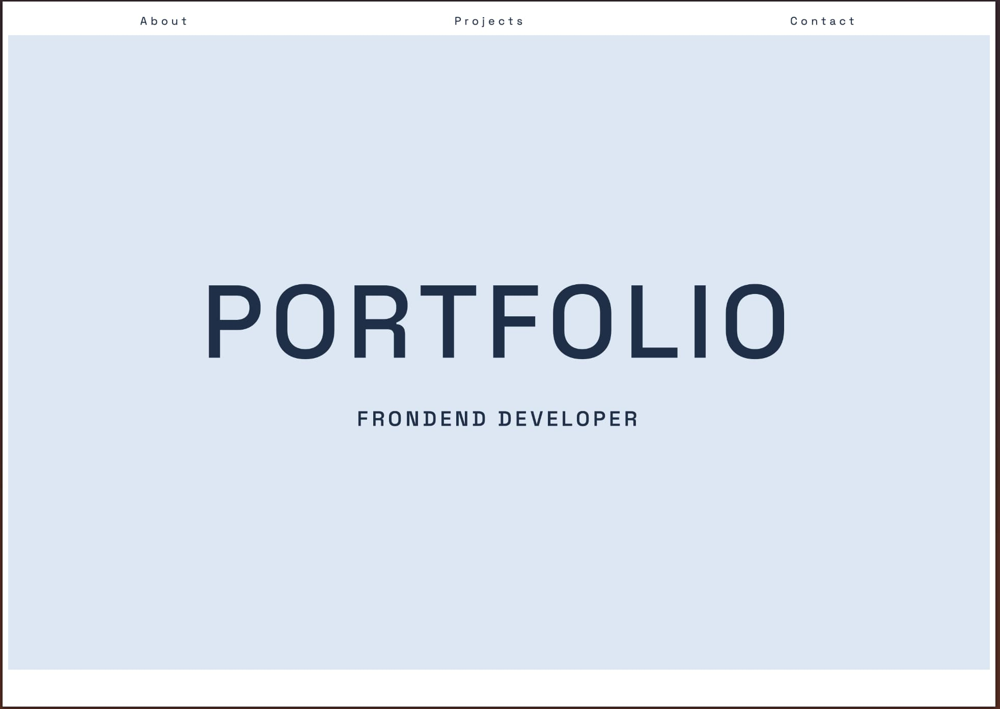

# FED1 Portfolio Course Assignment

## Description

This portfolio was created as the final submission for the first year of the Frontend Development programme at Noroff. It serves as a place to present my three major projects from this year:

- **Square Eyes** (Cross Course Project)
- **Community Science Museum** (Semester Project 1)
- **Square Eyes** (JavaScript 1 Course Assignment)

## Built With

- HTML
- CSS
- JavaScript
- GitHub

## Installing

To clone the repository: gh repo clone Martine04384/FED1-portfolio-woxholth-addison

## Running

This is a static project — no installation or build tools are required.

To run the site locally:

1. Open the project folder
2. Open `index.html` in your browser

You can also view the live version here:  
[Live site on GitHub Pages](https://martine04384.github.io/FED1-portfolio-woxholth-addison/)

## Contributing

This is a student project and is not accepting contributions, but feel free to fork the repo for learning purposes.

## Contact

[My GitHub](https://github.com/martine04384)

## Acknowledgments

Thanks to Noroff for the project brief and assets.
Code reviews and feedback from instructors and peers.
